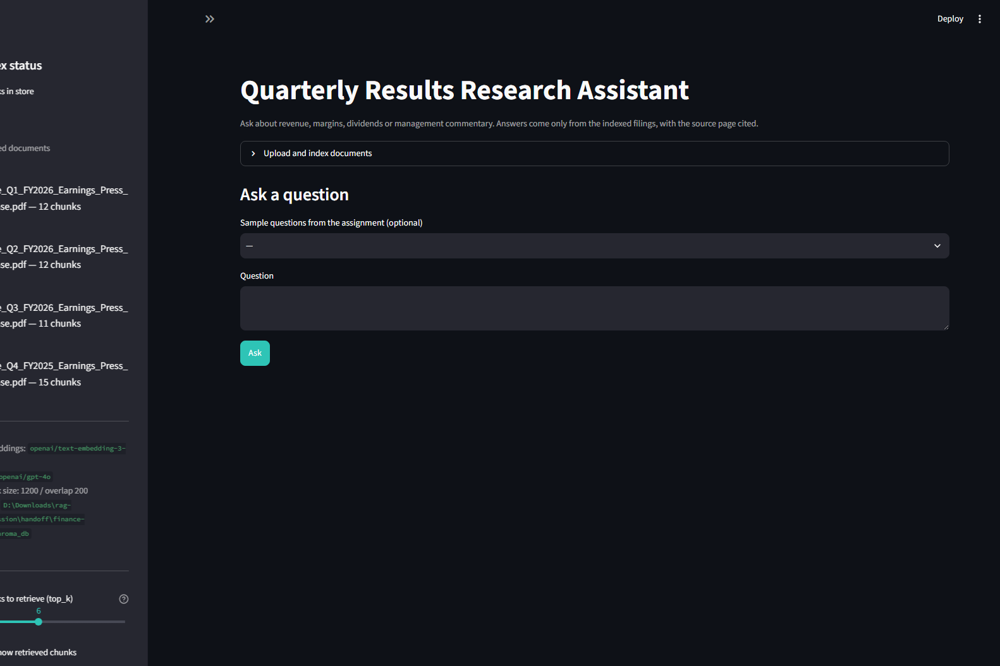
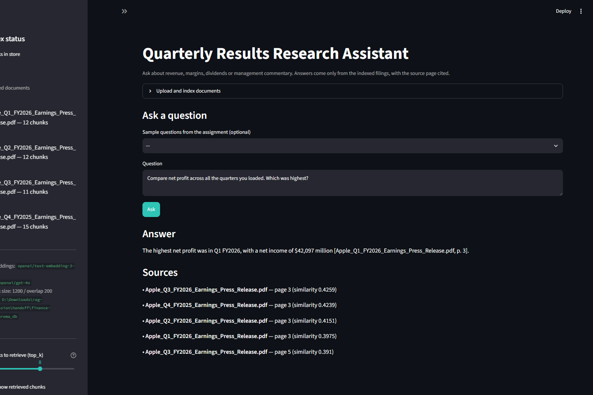
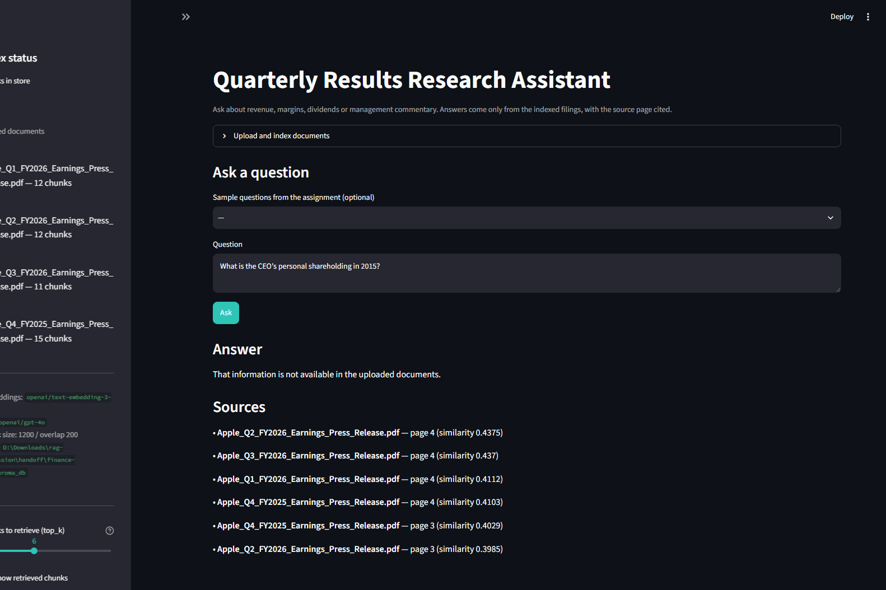
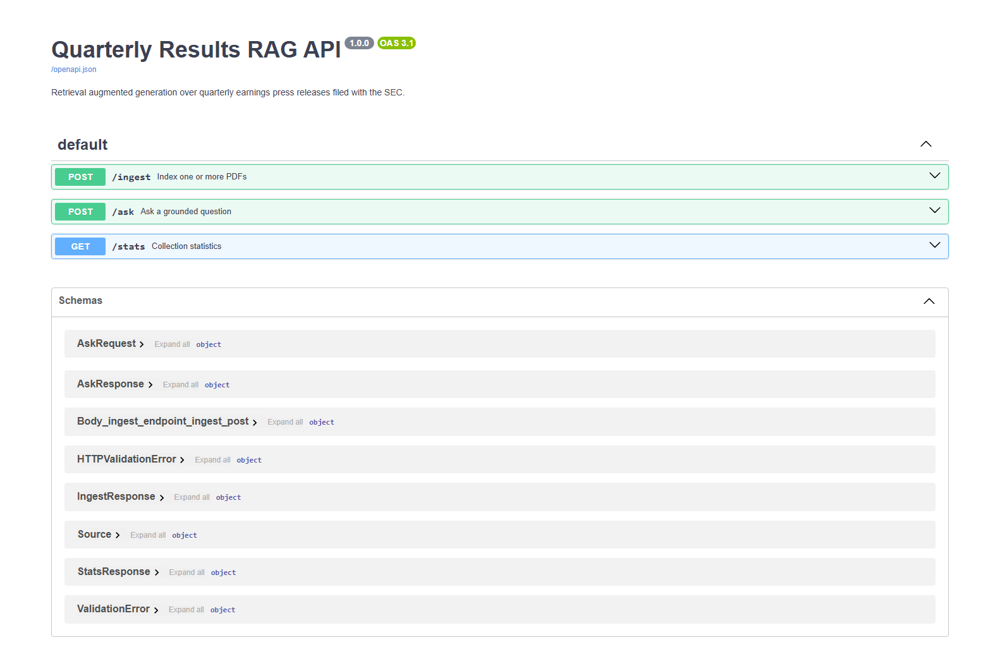

# Quarterly Results Research Assistant (Finance RAG)

A retrieval augmented generation system over **four consecutive quarters of
Apple Inc. earnings press releases**, filed with the SEC as Exhibit 99.1 to
Form 8-K.

| Quarter | Period ended | Source |
|---|---|---|
| Q4 FY2025 | 27 Sep 2025 | 8-K filed 30 Oct 2025, accession 0000320193-25-000077 |
| Q1 FY2026 | 27 Dec 2025 | 8-K filed 29 Jan 2026, accession 0000320193-26-000005 |
| Q2 FY2026 | 28 Mar 2026 | 8-K filed 30 Apr 2026, accession 0000320193-26-000011 |
| Q3 FY2026 | 27 Jun 2026 | 8-K filed 30 Jul 2026, accession 0000320193-26-000018 |

All four are retrievable from SEC EDGAR:
`https://www.sec.gov/cgi-bin/browse-edgar?action=getcompany&CIK=0000320193&type=8-K`

An analyst uploads the quarterly PDFs, asks a question in plain English, and
gets an answer with the source page cited, so the figure can be verified against
the filing before it goes into a client note.

### Why press releases rather than the audited statements

Apple also publishes a "Consolidated Financial Statements" PDF each quarter, and
it was the obvious first choice. It was rejected: it contains tables and nothing
else. The assignment asks what management said about the demand outlook, and
what risks are mentioned — neither has an answer in a pure statements PDF. The
8-K Exhibit 99.1 press release carries the same financial tables **plus** the CEO
and CFO commentary, the dividend declaration with its record date, and the
forward-looking-statement risk language. Every one of the ten test questions has
a home in it.

---

## Why this problem needs RAG

GPT-4o has never seen Apple's June 2026 quarter. Ask it for the revenue figure
and it will either refuse or produce a confident, plausible, wrong number.

1. **Read** — extract text from each PDF, page by page.
2. **Chunk** — recursive character splitting at 1200 characters, 200 overlap.
3. **Embed** — each chunk becomes a vector via `text-embedding-3-small`.
4. **Store** — persisted in ChromaDB on disk.
5. **Ask** — embed the question, retrieve the closest chunks, pass *only those*
   to GPT-4o.

---

## Setup

Requires Python 3.10 or above.

```bash
git clone https://github.com/Harsh1t-S/finance-rag
cd finance-rag

python -m venv .venv
source .venv/bin/activate          # Windows: .venv\Scripts\activate

pip install -r requirements.txt

cp .env.example .env               # then open .env and paste your key
```

```bash
python ingest.py                   # index the four PDFs in data/
streamlit run app.py               # http://localhost:8501
uvicorn api.main:app --reload      # optional backend, http://localhost:8000/docs
python run_test_questions.py --show-chunks
```

Expected indexing output:

```
  Apple_Q1_FY2026_Earnings_Press_Release.pdf: 5 pages -> 12 chunks
  Apple_Q2_FY2026_Earnings_Press_Release.pdf: 5 pages -> 12 chunks
  Apple_Q3_FY2026_Earnings_Press_Release.pdf: 5 pages -> 11 chunks
  Apple_Q4_FY2025_Earnings_Press_Release.pdf: 6 pages -> 15 chunks

4 files processed, 50 chunks stored.
```

### API endpoints (bonus)

| Method | Endpoint | Input | Output |
|---|---|---|---|
| POST | `/ingest` | One or more PDF files | `{"files": 4, "chunks": 50, ...}` |
| POST | `/ask` | `{"question": "...", "top_k": 6}` | `{"answer": "...", "sources": [...]}` |
| GET | `/stats` | — | Collection, chunk count, models |

---

## Design decisions

### Chunk size 1200, overlap 200

**One-line reason: the condensed statements of operations and the segment tables
are wide, and at 800 characters they split mid-table, detaching the row labels
from the figures.**

A chunk containing the numbers `45,781  41,198` without the `Americas` label
above them is worse than no chunk at all, because the model will still answer
from it. 1200 is the top of the permitted range and keeps each table intact. The
200-character overlap keeps a heading like "Segment Operating Performance"
attached to the table beneath it.

### top_k = 8

Questions 2, 3 and 6 compare figures **across quarters** — they need chunks from
three or four different PDFs at the same time, and each quarter's net income sits
in that quarter's own condensed statements table.

This value was corrected after being caught in testing, and the failure is worth
recording because it is the most dangerous kind this system produces:

| `top_k` | Quarters retrieved for "compare net profit" |
|---|---|
| 6 | 3 of 4 — **Q1 FY2026 missing** |
| 8 | 4 of 4 |

At `top_k=6` the app answered: *"The highest net profit was in Q3 FY2026, with a
net income of $29,789 million."* Fluent, correctly cited, and **wrong** — the
real answer is Q1 FY2026 at $42,097M, which was simply never retrieved. Nothing
in the output hinted that a quarter was missing.

The lesson is that the check has to be mechanical, so `run_test_questions.py`
prints how many distinct quarters were actually reached for every multi-quarter
question. Reading the answer will not reveal the problem.

### Page-level chunking, deterministic IDs

Each page is split independently so every chunk has an honest page number to
cite. Chunk IDs are a SHA-256 of `filename | page | text`, so re-indexing the
same file upserts rather than duplicating — pressing "Index" twice leaves you at
50 chunks, not 100.

---

## Deployment

Not deployed. The brief asks for a repository and a demo, not a hosted URL, and
a public deployment carrying a live API key can be spent by anyone who finds it.
`deploy/` contains a Render blueprint and a Dockerfile for anyone who wants to
stand one up; note that `chroma_db/` is ephemeral on both Render and Streamlit
Community Cloud, which is why the app has an **Index the files in data/** button
and ships the PDFs in `data/`.

---

## Screenshots

| | |
|---|---|
|  | **Indexed and persisted** — 50 chunks across the four filings, with the models and chunk settings shown in the sidebar. |
|  | **A cross-quarter comparison** — net profit across all four quarters, each figure cited to its filing and page, with all four sources retrieved. |
|  | **The trap question refused** — no shareholding data exists in these documents, and the app says so instead of inventing a figure. |
|  | **FastAPI `/docs`** — all three endpoints live: `POST /ingest`, `POST /ask`, `GET /stats`. |

---

## Test questions and answers

**[`docs/test_answers.md`](docs/test_answers.md) contains the answers this app
actually produced** for all ten questions, generated by
`python run_test_questions.py --show-chunks`. For each question it records the
answer, every source file and page with its similarity score, the raw retrieved
chunks, and — for the multi-quarter questions — how many distinct quarters
retrieval actually reached.

Below is the **hand-verified answer key**, read directly out of the four filings.
This is the reference those generated answers were checked against.

### Q1 — Total revenue in the most recent quarter
**$109.4 billion** in Q3 FY2026 (quarter ended 27 June 2026), up 16% year over
year. Total net sales of **$109,417 million** in the statements.

### Q2 — Net profit compared across quarters

| Quarter | Net income |
|---|---|
| Q4 FY2025 | $27,466 M |
| **Q1 FY2026** | **$42,097 M** ← highest |
| Q2 FY2026 | $29,578 M |
| Q3 FY2026 | $29,789 M |

**Q1 FY2026 was the highest**, which is the seasonal pattern — Apple's December
quarter carries the holiday iPhone cycle.

### Q3 — Latest quarter versus the same quarter last year
Q3 FY2026 revenue of **$109,417 M** against **$94,036 M** in the June 2025
quarter, **up 16%**. Net income **$29,789 M** against **$23,434 M**. Diluted EPS
**$2.02**, up 29%.

### Q4 — Management commentary
Tim Cook (CEO) on Q3 FY2026: Apple's strongest June quarter ever, with
double-digit revenue growth across iPhone, Mac and Services and in every
geographic segment, alongside the Siri AI launch at WWDC26.

Kevan Parekh (CFO): new June quarter records for both EPS and operating cash
flow, and the installed base of active devices at an all-time high across all
major product categories and geographic segments.

Cook on Q1 FY2026 described iPhone's best-ever quarter on unprecedented demand,
with all-time records in every geographic segment.

### Q5 — Fastest growing segment
Q3 FY2026 geographic net sales, quarter versus prior-year quarter:

| Segment | Q3 FY26 | Q3 FY25 | Growth |
|---|---|---|---|
| **Greater China** | $18,816 M | $15,369 M | **+22.43%** |
| Europe | $29,395 M | $24,014 M | +22.41% |
| Rest of Asia Pacific | $8,871 M | $7,673 M | +15.6% |
| Japan | $6,554 M | $5,782 M | +13.4% |
| Americas | $45,781 M | $41,198 M | +11.1% |

**Greater China, by two hundredths of a percentage point over Europe.** They are
effectively tied, and a good answer says so rather than declaring a clean winner.

### Q6 — Operating margin trend
See the honest notes below — this is the question the system handles worst. The
press releases headline **gross** margin (50.1% in Q3 FY2026), not operating
margin. Operating margin has to be derived from operating income divided by net
sales in the statements table, and the app does not reliably do that arithmetic
across four documents.

### Q7 — Dividend

| Quarter | Per share | Record date | Payable |
|---|---|---|---|
| Q4 FY2025 | $0.26 | 10 Nov 2025 | 13 Nov 2025 |
| Q1 FY2026 | $0.26 | 9 Feb 2026 | 12 Feb 2026 |
| Q2 FY2026 | $0.27 (+4%) | 11 May 2026 | 14 May 2026 |
| Q3 FY2026 | $0.27 | 10 Aug 2026 | 13 Aug 2026 |

The Q2 FY2026 release also notes an authorised increase to the share repurchase
programme.

### Q8 — Risks and headwinds
Thinner than the other answers, and honestly so. The releases carry the standard
forward-looking-statements caveat, and Q3 FY2026 discloses that gross margin
included roughly 2 percentage points of favourable impact from **tariff
refunds**, with $0.11 of EPS attributable to the same — a real, quantified,
non-recurring item. A press release is not a risk-factors section; the 10-Q would
be the right document for a full risk answer.

### Q9 — Three-line client summary
A synthesis question with no single right answer. It should draw on Q3 FY2026
revenue of $109.4 billion (+16%), EPS of $2.02 (+29%), the June-quarter records
across iPhone, Mac and Services, and the tariff-refund caveat on margin.

### Q10 — Trap question
"What is the CEO's personal shareholding in 2015?"

Nothing in the four documents touches Tim Cook's personal shareholding, and none
of them covers 2015. The app must reply that the information is not available.
**It must not invent a figure.**

---

## Honest notes — what did not work well

**Operating margin (Q6) is the weakest answer, and it is an arithmetic problem
rather than a retrieval one.** The press releases state gross margin, not
operating margin. Getting Q6 right means pulling operating income and net sales
out of the statements table for each of four quarters and dividing — twelve
numbers across four documents, then a trend judgement. GPT-4o will sometimes
report gross margin and label it operating margin, which is exactly the kind of
confidently-wrong output an analyst would act on. Retrieval is fine; the chunks
contain the right rows. A calculation tool would fix this properly, and adding
one is outside what the brief permits.

**Cross-quarter comparisons fail silently at low `top_k`.** At `top_k=3` the
answer to "compare net profit across all the quarters" is fluent, well formatted,
and drawn from one quarter. Nothing in the output signals the problem. This is
why `run_test_questions.py` prints how many distinct quarters were actually
retrieved for each comparison question — the check has to be mechanical, because
reading the answer will not reveal it.

**Multi-column table extraction is lossy.** Apple's statements put the current
quarter, the prior-year quarter, and the year-to-date columns side by side.
`pypdf` flattens these into a run of numbers, and the model occasionally reads a
year-to-date figure as a quarterly one. The $101,464 M nine-month net income
sitting on the same row as the $29,789 M quarterly figure is a live trap. Two of
three spot-checks were correct; the third needed the source page opened to
confirm. Anyone using this for real work must click through to the citation.

**The source PDFs were generated from EDGAR HTML.** SEC filings are published as
HTML, so `wkhtmltopdf` was used to render Exhibit 99.1 to PDF. The text layer is
clean and selectable and the content is unmodified, but the page breaks are the
renderer's, not Apple's, so cited page numbers correspond to this repository's
PDFs rather than to any Apple-published pagination.

**`yfinance` was not added.** The brief offers it as an optional extra. It was
left out deliberately: it pulls live market data that cannot be verified against
the indexed documents, and mixing an unverifiable live number into an answer
whose entire value proposition is "every figure traces to a cited page"
undermines the point of the system.

**50 chunks is a small corpus.** With `top_k=6`, retrieval touches over a tenth
of the collection on every query, so retrieval quality flatters itself here. On a
realistic corpus this configuration would need re-tuning.

---

## Repository structure

```
finance-rag/
├── app.py                    # Streamlit interface
├── ingest.py                 # load, chunk, embed, store in Chroma
├── rag.py                    # retrieve + prompt + call GPT-4o
├── config.py                 # all tunables in one place
├── run_test_questions.py     # runs the 10 assignment questions
├── api/main.py               # optional FastAPI backend
├── data/                     # the four quarterly PDFs
├── chroma_db/                # persisted vector store (gitignored)
├── docs/                     # generated test answers (see docs/README.md)
├── deploy/                   # Render blueprint, Dockerfile, hosting notes
├── requirements.txt
├── .env.example
├── .gitignore
└── README.md
```

## Stack

| Component | Choice |
|---|---|
| Language | Python 3.10+ |
| PDF reading | `pypdf` |
| Chunking | `RecursiveCharacterTextSplitter`, 1200 / 200 |
| Embeddings | OpenAI `text-embedding-3-small` |
| Vector store | ChromaDB, persisted to `chroma_db/` |
| Answering model | GPT-4o, temperature 0 |
| Orchestration | Plain `openai` SDK |
| Interface | Streamlit |
| Backend (bonus) | FastAPI + Uvicorn |
| Secrets | `.env` via `python-dotenv`, gitignored |
